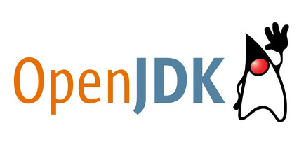

Programming tools, frameworks are becoming more and more developer friendly and offer better and modern features to boost developer productivity.  
Java was for a long time infamous for having slow release trains. 
However, keeping up with times, Java has moved to a cadence of releasing new features with a version upgrade every 6 months (every March and September). 
Since then there have been a lot of cool features and tools that have been added to every java developer's toolset. 

This is __a quick summary of the latest features introduced between Java 9 to Java 13__.


Please note, the features that I talk about here are the ones that, I believe, either add cool features or increase developer productivity the most.  
This is not an exhaustive list. 

## Java 9
**Module system**: Helps in modularisation of large apps. This helps to limit exposure of classes that are public in the module vs the true public api of the module. 
Explicitly define dependencies and exports in `module-info.java`. Eg:
```java
module chef {
  exports com.tbst.recipe;

  requires kitchen;
}
```
Here, the module `chef` depends on module `kitchen` and exports module `recipe`.

**Jlink**: Having explicit dependencies and modularized JDK means that we can easily come up with the entire dependency graph of the application. This, in turn, enables having a minimal runtime environment containing only the necessary to run the application. This can help to reduce the overall size of the executable jar.


**jshell**: An interactive REPL (Read-Eval-Print-Loop) for quickly playing with java code. Just say `jshell` on the terminal after installing JDK 9+.

**Collection factory methods**: Earlier, one had to initialize an implementation of a collection (Map, Set, List) first and then add objects to it. Finally, it's possible to create the ***immutable*** collections with static factory methods of the signature `<Collection>.of()`. This is achieved by having a bunch of static methods in each of the respective interfaces. Eg:
```java
// Creates an immutable list
List<String> abcs = List.of("A", "B", "C");

// Creates an immutable set
Set<String> xyzs = Set.of("X", "Y", "Z");

// Creates an immutable Map
Map<String, String> mappings = Map.of("key1", "value1", "key2", "value2");
```

**Other features**
    - Stream API gets more functions like `dropWhile`, `takeWhile`, `ofNullable`.
    - Private interface methods to write clean code and keep things DRY when using default methods in interfaces.
    - new HTTP2 API that supports streams and server based pushes.
    
____
## Java 10
**Local-Variable Type Inference**: This enables us to write more modern Kotlin/Scala/Typescript like syntax where you don't have to explicitly declare the variable type without compromising type safety. Here, the compiler is able to figure out the type because of the type of the value on the right hand side in case of assignments. Eg:
```java
var list = new ArrayList<String>();  // infers ArrayList<String>
var stream = list.stream();          // infers Stream<String>
```

In cases where the compiler cannot infer the value or it's ambiguous, you need to explicitly declare it. More details [here](http://openjdk.java.net/jeps/286)

**Parallel Full GC for G1**: Improves G1 worst-case latencies by making the full GC parallel.

**Experimental Java-Based JIT Compiler**: Enables the Java-based JIT compiler, Graal, to be used as an experimental JIT compiler on the Linux/x64 platform.

**Heap Allocation on Alternative Memory Devices**: Enables the HotSpot VM to allocate the Java object heap on an alternative memory device, such as an NV-DIMM, specified by the user.

**Root certificates in JDK**: Open-source the root certificates in Oracle's Java SE Root CA program in order to make OpenJDK builds more attractive to developers, and to reduce the differences between those builds and Oracle JDK builds.

____
## Java 11

**New String methods**: String class gets new methods like `isBlank()`, `lines()`, `repeat(int)`, unicode aware `strip()`, `stripLeading()` and `stripTrailing()`.

**New File Methods**: `writeString()`, `readString()` and `isSameFile()`.

**Local-Variable Syntax for Lambda Parameters**: Allow var to be used when declaring the formal parameters of implicitly typed lambda expressions. 
This is introduced to have uniformity with use of `var` for local variables. Eg:

```java
(var x, var y) -> x.process(y)   // implicit typed lambda expression

// One benefit of uniformity is that modifiers, notably annotations, can be applied
// to local variables and lambda variables without losing brevity.
(@Nonnull var x, @Nullable var y) -> x.process(y)
```

**JEP 328: Flight Recorder**: JFR is a profiling tool used to gather diagnostics and profiling data from a running Java application.
Its performance overhead is negligible and that’s usually below 1%. Hence it can be used in production applications.

**Removed the Java EE and CORBA Modules**:  Following packages are removed: `java.xml.ws`, ` java.xml.bind`, ` java.activation`, ` java.xml.ws.annotation`, ` java.corba`, ` java.transaction`, ` java.se.ee`, ` jdk.xml.ws`, ` jdk.xml.bind`

**Implicitly compile and run** No need to compile files with `javac` first. You can directly use `java` command and it implicitly compiles. This is done to run a program supplied as a single file of Java source code, including usage from within a script by means of "shebang" files and related techniques. Of course for any project bigger than a file, you would use a build tool like gradle, maven, etc.

____
## Java 12 - Released March 19, 2019

**Switch expression😎** The new `switch` expression expects a returns value. Multiple matches can go on the same line separated by comma and what happens on match is marked with `->`.
Unlike the traditional `switch`, matches don't fall through to the next match. So you don't have to use `break;` and this helps prevent bugs. Eg:
```java
String status = process(..., ..., ...);
var isCompleted = switch (status) {
    case "PROCESSED", "COMPLETED" -> true;
    case "WAITING", "STUCK" -> false;
    default -> throw new InconsistentProcessingStateException();
};
```
The switch expression is introduced as a preview and requires `--enable-preview` flag to the javac or enabling it in your IDE.

**File byte comparison** with `File.mismatch()`. ([From Javadoc](https://docs.oracle.com/en/java/javase/12/docs/api/java.base/java/nio/file/Files.html#mismatch(java.nio.file.Path,java.nio.file.Path))) Finds and returns the position of the first mismatched byte in the content of two files, or -1L if there is no mismatch.

**Collections.teeing** Streams API gets a new function that applies 2 functions (consumers) on the items and then merges/combines the result of those 2 functions using a third function to produce the final result.  
[From Javadoc](https://docs.oracle.com/en/java/javase/12/docs/api/java.base/java/util/stream/Collectors.html#teeing(java.util.stream.Collector,java.util.stream.Collector,java.util.function.BiFunction)) - Returns a Collector that is a composite of two downstream collectors. Every element passed to the resulting collector is processed by both downstream collectors, then their results are merged using the specified merge function into the final result. 

**String methods**: `indent(int n)`, `transform(Function f)`.

**Smart cast** `instanceOf` can be used now to do a smart cast as below:
```java
...
} catch (Exception ex) {
    if(ex instanceOf InconsistentProcessingStateException ipse) {
        // use ipse directly as InconsistentProcessingStateException
    }
}
```

**JVM improvments**: Low pause GC with Shenandoah, micro-benchmark capabilities, constants API and other improvements.

____
## Java 13 - Released September 17, 2019

**Multi-line texts**: It's now possible to define multiline strings without ugly escape sequences `\` or appends. Eg:
```java
var jsonBody = """
    {
        "name": "Foo",
        "age": 22
    }
""";
```
This is introduced as a preview and requires `--enable-preview` flag to the javac or enabling it in your IDE.

**String** gets more methods like `formatted()`, `stripIndent()` and `translateEscapes()` for working with multi-line texts.

**Switch expression** Still in preview and based on feedback now supports having `: yield` syntax in addition to `->` syntax. Hence, we can write
```java
String status = process(..., ..., ...);
var isCompleted = switch (status) {
    case "PROCESSED", "COMPLETED": yield true;
    case "WAITING", "STUCK": yield false;
    default: throw new RuntimeException();
};
```

**Socket API** reimplemented with modern NIO implementation. This is being done to overcome limitations of legacy api and build a better path towards Fiber as part of [Project Loom](https://cr.openjdk.java.net/~rpressler/loom/Loom-Proposal.html)

**Z GC** improved to release unused memory.
___

Wow, it's getting crazy out there. 
If you are a developer that started a decent size Java project recently in the hopes that you would use the latest features and keep yourself and the project updated with the latest versions, do you feel a pressure to catchup with these frequent releases?  
Add your comments below or tweet them to me.


A parting gift - I use [Jenv](https://github.com/jenv/jenv) to easily switch between different jdk versions locally while switching between different projects. It's pretty cool to manage multiple jdk versions.

___
### References and good articles:
* Java 9 - [pluralsite](https://www.pluralsight.com/blog/software-development/java-9-new-features)
* Java 10 - [techworld](https://www.techworld.com/developers/java-10-features-whats-new-in-java-10-3680317/), [dzone](https://dzone.com/articles/java-10-new-features-and-enhancements)
* Java 11 - [geeksforgeeks](https://www.geeksforgeeks.org/java-11-features-and-comparison/), [journaldev](https://www.journaldev.com/24601/java-11-features)
* Java 12 - [journaldev](https://www.journaldev.com/28666/java-12-features), [stackify](https://stackify.com/java-12-new-features-and-enhancements-developers-should-know/)
* Java 13 - [jaxenter](https://jaxenter.com/java-13-jdk-deep-dive-new-features-162272.html), [infoworld](https://www.infoworld.com/article/3340052/jdk-13-the-new-features-in-java-13.html), [dzone](https://dzone.com/articles/81-new-features-and-apis-in-jdk-13)